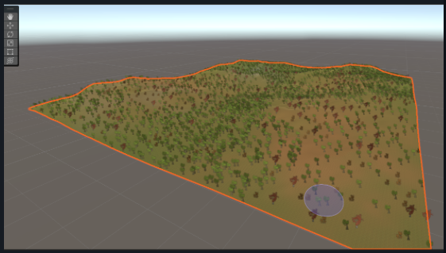
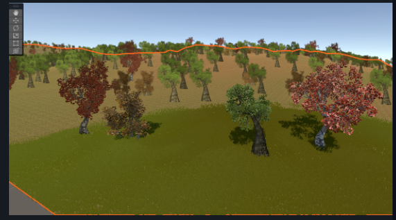
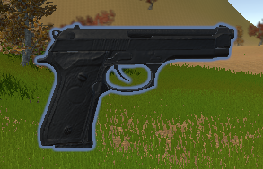
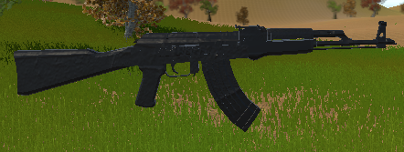
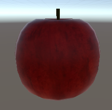
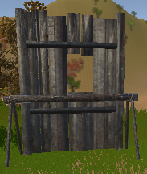
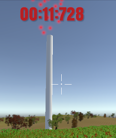
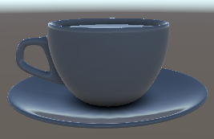
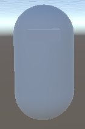

# Eden- A First-Person Shooter Survival Game
A project in the computer graphics lab, University of Haifa, 2023.

## Game Overview

**Genre:** First-Person Shooter, Survival

Welcome to Eden Log, an adrenaline-pumping first-person shooter game with survival elements set in a haunting woods infested with zombies. Inspired by the Call of Duty's Zombies mode and PUBG, the game challenges players to survive against hordes of undead while collecting resources and strategically navigating through stages.

## Gameplay

### Objective

Your goal is to survive as long as possible by exploring the haunting woods, collecting resources, and moving strategically to fend off relentless waves of zombies. As you progress through stages, you'll face formidable targets that must be defeated by standing in their hot zone. This action attracts all nearby zombies, raising the stakes for survival.

To stay alive, you must master resource management, make strategic decisions, and rely on quick reflexes as you navigate the parameter, searching for ammo and supplies. The game keeps you on the edge of your seat, offering a thrilling experience that challenges your survival skills to the limit.

### The Woods

You find yourself trapped in a dense and eerie woods filled with tall trees. As the game progresses, the challenges intensify with more zombies lurking around every corner.

### Weapons & Ammo

Start with a basic gun and a limited supply of ammunition. Scour the map for supply drops to replenish your ammo. There's no limit to how much you can carry.

### Health & Apples

Keep an eye on your health bar as each zombie encounter chips away at your vitality. To regenerate health, search for apples scattered throughout the woods.

### Construction

Locate special construction packages in supply drops and use them to build fences. These fences offer a temporary shield against zombies in the hot zone, providing a crucial defense mechanism.

### Stages & Targets

The game is divided into stages of increasing difficulty. Each stage houses a "target" that you must destroy by entering its hot zone. However, this action attracts all nearby zombies, raising the stakes for survival.

### Speed Boost

In dire situations, find and consume coffee or speed boots from supply drops to boost your speed and escape danger.

### Inventory Management

Strategically manage your inventory, which can hold unlimited ammo, one apple for healing, and one construction package at a time.

### Enemies & AI

The woods are crawling with zombies, and their numbers grow with each passing stage. Encounter relentless and relentless hordes of undead that chase and attack upon sight.

## Screenshots

## Download and Play

At this stage, the game can be run within the Unity editor. However, you have the flexibility to build and deploy it on your selected platform for a seamless gaming experience.
